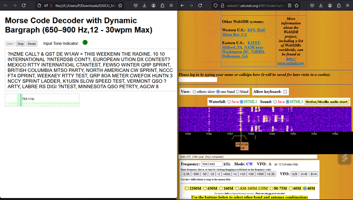

# MorseDecoder

A simple Morse code decoder that runs in a web browser window using audio from the computer microphone. It automatically adjusts for speeds between about 12 and 30 words per minute with the Morse code audio frequency between 650 and 790 Hz.  It should work on most any computer, tablet, or smartphone where you can run a modern web browser.

MorseDecoder was written by Paul Harrison DJ0CU/G4ADF.  [This repository](https://github.com/pflarue/MorseDecoder), using a Zero Clause BSD license, was created with his permission.

Since MorseDecoder uses your computer's microphone to get the audio to decode, you can use it with your computer or smartphone sitting near an amateur or shortwave radio that is receiving morse code.  Fine tuning is required to get the audio frequency between 650 and 790 Hz.  You can also run MorseDecoder.html in one browser window, while getting audio from a Web SDR such as one at the [Northern Utah WebSDR](http://websdr1.sdrutah.org:8901/index1a.html) in another browser window.  Thus, your computer plays the audio through your speakers and re-captures the audio from your microphone.  Here is a screenshot of using that approach to decode a CW transmission from W1AW:

When you press the `Start` button, your browser will ask you to allow this page to use the microphone.  Depending on your browser and operating system, it may also ask you to allow your web browser to use the microphone, and it may give you the option to choose which microphone to use.  Your web browser will probably only allow a web page served from a secure context to access a microphone.  This means that MorseDecoder.html must usually be served as `https` rather than just `http`.  However, for local use, it may also be served from `http://127.0.0.1`, `http://localhost`, `http://*.localhost`, or `file://`.  That last option means that you should be able to open a copy of MorseDecoder.html stored as a file on your own computer so that it can be used without an internet connection.

Try it using it live at [html-preview.github.io](https://html-preview.github.io/?url=https://github.com/pflarue/MorseDecoder/blob/main/MorseDecoder.html).
